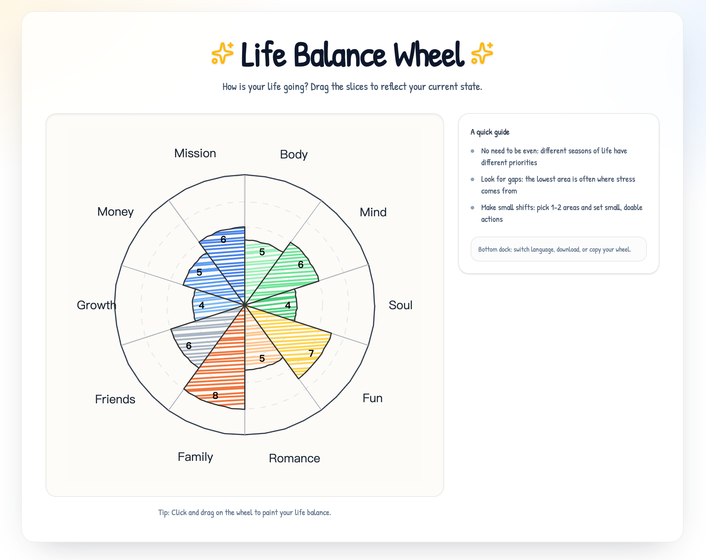

# Life Balance Wheel

An interactive “life balance wheel” you can doodle by dragging slices, then download or copy as an image.

## Features

- Drag slices to adjust scores
- Hover labels to see category descriptions
- i18n (English / 中文) with language persisted in localStorage
- Bottom dock actions: switch language, download PNG, copy image to clipboard

## Tech Stack

- Vite + React + TypeScript
- Tailwind CSS
- i18next + react-i18next

## Getting Started

**Prerequisites:** Node.js (recommend using `pnpm`)

1. Install deps
   - `pnpm install`
2. Start dev server
   - `pnpm dev`

## Inspiration

- https://medium.com/hannah-lin/%E7%A8%8B%E5%BC%8F%E7%A2%BC%E8%88%87%E5%B0%BF%E5%B8%83-%E5%AA%BD%E5%AA%BD%E5%B7%A5%E7%A8%8B%E5%B8%AB%E7%9A%84%E7%94%9F%E5%AD%98%E6%8C%87%E5%8D%97-fc4dce437784
